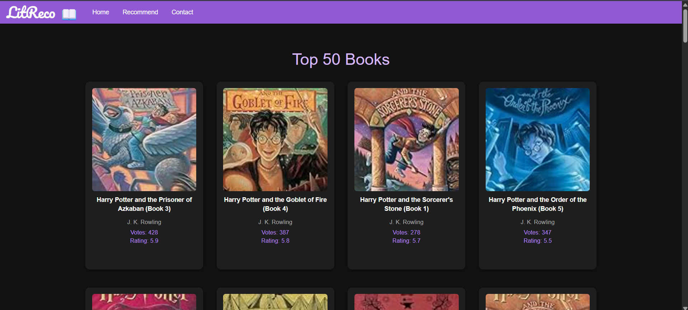
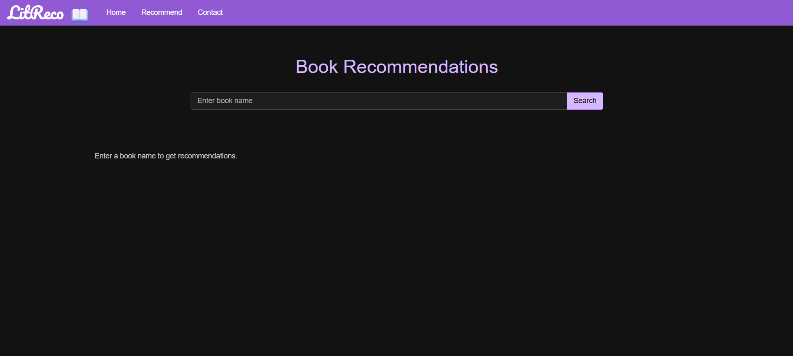
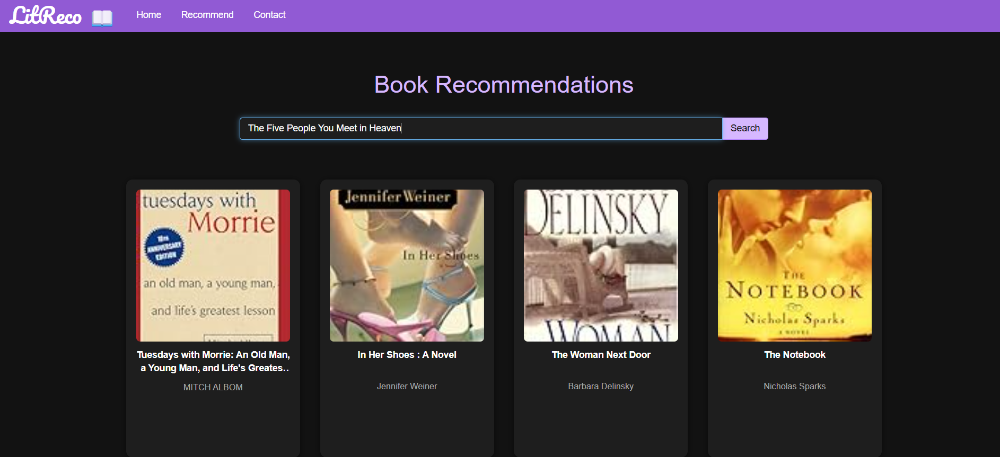

# LitRec 📚✨

**LitRec** is a modern, responsive book recommendation system built with Python and Flask. It features collaborative filtering for personalized book suggestions, a clean UI, and essential functionality for discovering books efficiently.

## Features

- Search for books and get instant recommendations
- Collaborative filtering-based recommendations
- Displays book title, author, votes, and ratings
- Clean and responsive UI using Bootstrap

## Tech Stack

- **Python** — Backend logic and recommendation system
- **Flask** — Web framework for serving the app
- **Pandas & NumPy** — Data processing and similarity calculations
- **HTML, CSS, Bootstrap** — Frontend and responsive design
- **Jupyter Notebook** — Data exploration and analysis

## Screenshots

